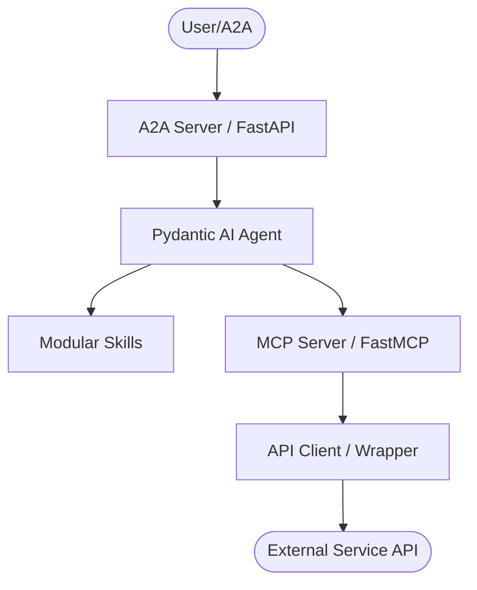
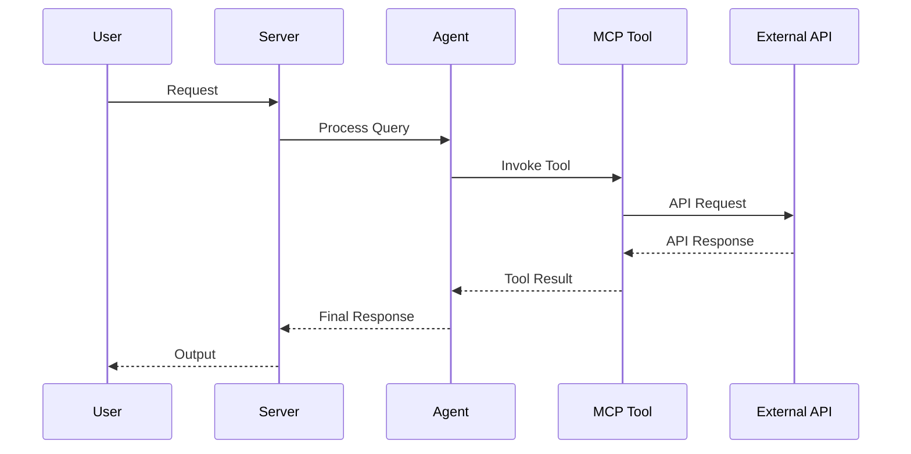

# AGENTS.md

> Claude Code loads this file via `CLAUDE.md` (`@AGENTS.md` import) — the two stay
> in sync. Edit **this** file, not `CLAUDE.md`.

## OneTrust-Specific Notes (READ FIRST)

This package achieves **100% OneTrust API coverage by code generation**, not by
hand. The single source of truth is the vendored OpenAPI specs under
`onetrust_api/specs/*.json`.

- **Do not hand-edit generated files.** These are emitted by
  `scripts/generate_from_openapi.py` and will be overwritten:
  `onetrust_api/api/api_client_<domain>.py`, `onetrust_api/api_client.py`,
  `onetrust_api/api/_operation_manifest.py`, `onetrust_api/mcp/mcp_<domain>.py`,
  and `onetrust_api/mcp/__init__.py`. Change the **generator** instead, then
  re-run it and `ruff format .`.
- **Hand-authored core** (safe to edit): `onetrust_api/api/api_client_base.py`
  (auth, pagination, retry, URL resolution), `onetrust_api/auth.py`,
  `onetrust_api/onetrust_models.py`, `onetrust_api/mcp/mcp_custom_api.py`.
- **Refresh flow** when OneTrust changes a spec: re-download specs →
  `python scripts/generate_from_openapi.py` → `ruff format .` →
  `pytest` (the coverage keystone in `tests/test_onetrust_coverage.py` proves
  spec operations == client methods == MCP actions).
- **Tool surface (`MCP_TOOL_MODE`).** `condensed` (default) registers the
  per-domain action-routed tools; `verbose` registers one fully-typed 1:1 tool
  per API method, with parameter types/descriptions sourced from
  `_operation_manifest.py`'s `params`; `both` registers both. The manifest's
  `params`/`summary` fields exist specifically to drive the shared
  `register_verbose_tools` typed tier — generated, do not hand-edit.
  (CONCEPT:AU-ECO.mcp.tool-mode-standardization)

## Tech Stack & Architecture
- Language/Version: Python 3.10+
- Core Libraries: `agent-utilities`, `fastmcp`, `pydantic-ai`
- Key principles: Functional patterns, Pydantic for data validation, asynchronous tool execution.
- Architecture:
    - `mcp_server.py`: Main MCP server entry point and tool registration.
    - `agent_server.py`: Pydantic AI agent definition and logic.
    - `skills/`: Directory containing modular agent skills (if applicable).

### Architecture Diagram


### Workflow Diagram


## Commands (run these exactly)
# Installation
pip install .[all]

# Quality & Linting (run from project root)
pre-commit run --all-files

# Execution Commands
# Run MCP Server
onetrust-mcp
# Run Agent
onetrust-agent

## Project Structure Quick Reference
- MCP Entry Point → `mcp_server.py`
- Agent Entry Point → `agent_server.py`
- Source Code → onetrust_api/
- Skills → `skills/` (if exists)

### File Tree
```text
├── .bumpversion.cfg
├── .dockerignore
├── .env
├── .gitattributes
├── .gitignore
├── .pre-commit-config.yaml
├── AGENTS.md
├── Dockerfile
├── LICENSE
├── MANIFEST.in
├── README.md
├── compose.yml
├── debug.Dockerfile
├── onetrust_api
│   ├── __init__.py
│   ├── agent_server.py
│   ├── auth.py
│   └── mcp_server.py
├── pyproject.toml
└── requirements.txt
```

## Code Style & Conventions
**Always:**
- Use `agent-utilities` for common patterns (e.g., `create_mcp_server`, `create_agent`).
- Define input/output models using Pydantic.
- Include descriptive docstrings for all tools (they are used as tool descriptions for LLMs).
- Check for optional dependencies using `try/except ImportError`.

**Good example:**
```python
from agent_utilities import create_mcp_server
from mcp.server.fastmcp import FastMCP

mcp = create_mcp_server("my-agent")

@mcp.tool()
async def my_tool(param: str) -> str:
    """Description for LLM."""
    return f"Result: {param}"
```

## Dos and Don'ts
**Do:**
- Run `pre-commit` before pushing changes.
- Use existing patterns from `agent-utilities`.
- Keep tools focused and idempotent where possible.

**Don't:**
- Use `cd` commands in scripts; use absolute paths or relative to project root.
- Add new dependencies to `dependencies` in `pyproject.toml` without checking `optional-dependencies` first.
- Hardcode secrets; use environment variables or `.env` files.

## Safety & Boundaries
**Always do:**
- Run lint/test via `pre-commit`.
- Use `agent-utilities` base classes.

**Ask first:**
- Major refactors of `mcp_server.py` or `agent_server.py`.
- Deleting or renaming public tool functions.

**Never do:**
- Commit `.env` files or secrets.
- Modify `agent-utilities` or `universal-skills` files from within this package.

## When Stuck
- Propose a plan first before making large changes.
- Check `agent-utilities` documentation for existing helpers.

<!-- BEGIN concept-coordination (generated) -->
## Concept-ID Coordination (multi-session)

Working in parallel with other sessions/worktrees? **Reserve a concept id before you write its `CONCEPT:` marker** so two sessions never collide:

```bash
agent-utilities --json concept reserve --ns EG-KG.compute.backend   # or a package prefix, e.g. KEY
```

Full protocol (ledger, merge=union, reconcile, MCP/REST): <https://knuckles-team.github.io/agent-utilities/concept_coordination/>
<!-- END concept-coordination (generated) -->

## Version & lockfile drift edict (keep the version mirrors AND the lock in sync)

The two most common release-breakers in this fleet are **version drift** (the version in
`pyproject.toml`/`.bumpversion.cfg` advancing while `README.md`, `docker/Dockerfile`, and the
module `__version__`s lag) and a **stale `uv.lock`** (shipping known-vulnerable transitive deps).
A version mismatch makes the next `bump-my-version` throw `VersionNotFoundException`; a stale lock
is what Dependabot flags. Rules:

1. **Never hand-edit a version string.** Change the version ONLY via
   `bump-my-version bump {patch|minor|major}` (a.k.a. `bump2version`), which rewrites every file
   registered in `.bumpversion.cfg` in one atomic, tagged commit. If you edited the version in
   `pyproject.toml` by hand, you created drift — revert and use the bumper.
2. **Every version-bearing file must be registered in `.bumpversion.cfg`** — at minimum
   `pyproject.toml` AND `README.md`, plus `docker/Dockerfile` and any module `__version__`. Never
   add a file that embeds the version without a `[bumpversion:file:...]` entry for it.
3. **Re-lock on every dependency change.** After editing `pyproject.toml` deps/extras, run
   `uv lock` and commit `uv.lock` in the SAME change. The `uv-lock` pre-commit hook runs with
   `--locked` and fails on drift — never bypass it. The committed `uv.lock` is the
   Dependabot/security surface.
4. **Patch CVEs with a version floor at the source, then re-lock.** `uv` resolves one version
   graph-wide, so a lower-bound in the extra that pulls a dependency raises it for the whole lock.

## Upstream currency edict — target the newest release; a pin is a hypothesis, not a fact (READ BEFORE capping, deferring, or opt-in-gating an upgrade)

This governs how we treat **other people's** releases, deprecations, and version caps in
this repo (fleet-wide edict, propagated from `agent-utilities/AGENTS.md`).

1. **Latest by default.** Target the newest upstream release -- including a pre-release
   where the ecosystem has already moved onto it. Sitting on an old major because the
   upgrade is work is not a reason to defer it.
2. **A conservative upstream pin is a hypothesis, not a fact -- test it, don't inherit
   it.** Upstream maintainers cap defensively (an unreleased major, an untested surface)
   as often as they cap for a known break. Worked example (from `agent-utilities`):
   `pydantic-ai-slim` 2.18.0 declared `fastmcp-slim[client]>=3.3.0` with no upper bound;
   2.19.0 added `<4` purely as a defensive guard while fastmcp 4 was still pre-release --
   not because of an observed incompatibility. Blocking an upgrade on that kind of cap
   without testing it is the wrong default.
3. **Forward-fix only.** When an upgrade breaks something, fix the break to proceed --
   do not pin backwards, vendor a fork, or route around it. If a break is genuinely
   unfixable inside this repo, say exactly what and why, and carry a plan to unblock it
   -- never an indefinite pin.
4. **Deprecations are fixed on sight, in code AND in tests.** A `DeprecationWarning` from
   an upstream library is a defect to fix now, not noise to filter. **Never** silence one
   with a warning filter, `# noqa`, or a pytest `filterwarnings` entry in order to go
   green.
5. **Adopt upstream features rather than reimplementing them.** If upstream ships a
   capability this repo hand-rolled, migrate to theirs and delete the local one.
6. **Nothing built on an upgrade ships opt-in.** A new capability an upgrade unlocks is
   default-on unless it genuinely costs compute, in which case it is policy-selected,
   never flag-gated. An opt-in extra or a dependency-conflict fork is an interim state
   that must carry a written plan to become the default, never a resting place.
