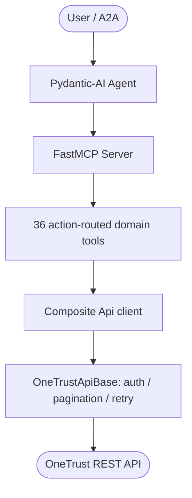

# Overview

`onetrust-api` wraps the entire OneTrust public API surface and exposes it three
ways: a typed Python client, an MCP server, and an A2A agent.

## 100% coverage, generated from the specs

OneTrust publishes 35 machine-readable OpenAPI 3.x specifications. This package
**vendors** all of them under `onetrust_api/specs/*.json` and runs
`scripts/generate_from_openapi.py` to emit, from that single source of truth:

- `onetrust_api/api/api_client_<domain>.py` — one method per operation, composed
  into the single `Api` class via multiple inheritance.
- `onetrust_api/api/_operation_manifest.py` — the `operationId → method → action`
  map that drives coverage verification.
- `onetrust_api/mcp/mcp_<domain>.py` — one consolidated, action-routed MCP tool
  per domain.

`tests/test_onetrust_coverage.py` then asserts the three sets — spec operations,
client methods, and MCP actions — are mutually consistent. If OneTrust revises a
spec, re-running the generator and the test guarantees nothing silently drops.

## Product areas

| Area | Example domains (MCP tags) |
| --- | --- |
| AI Governance | `ai_governance` |
| Consent & Preference Management | `cmp`, `consent_receipts`, `cookie_consent`, `universal_consent`, `privacy_notices`, `mobile_app_consent`, `cross_device_consent` |
| Data Use Governance | `data_catalog`, `data_discovery`, `data_discovery_worker` |
| Privacy Automation | `dsar`, `assessments`, `data_mapping`, `incidents` |
| Tech Risk & Compliance | `audit_management`, `compliance_automation`, `policy_management`, `issues_management`, `it_risk_management`, `training` |
| Third-Party Management | `tprm` |
| ESG | `esg` |
| Platform | `access_management`, `bulk_export`, `documents`, `integrations`, `inventory`, `object_manager`, `task_management`, `user_provisioning` |

## Architecture

